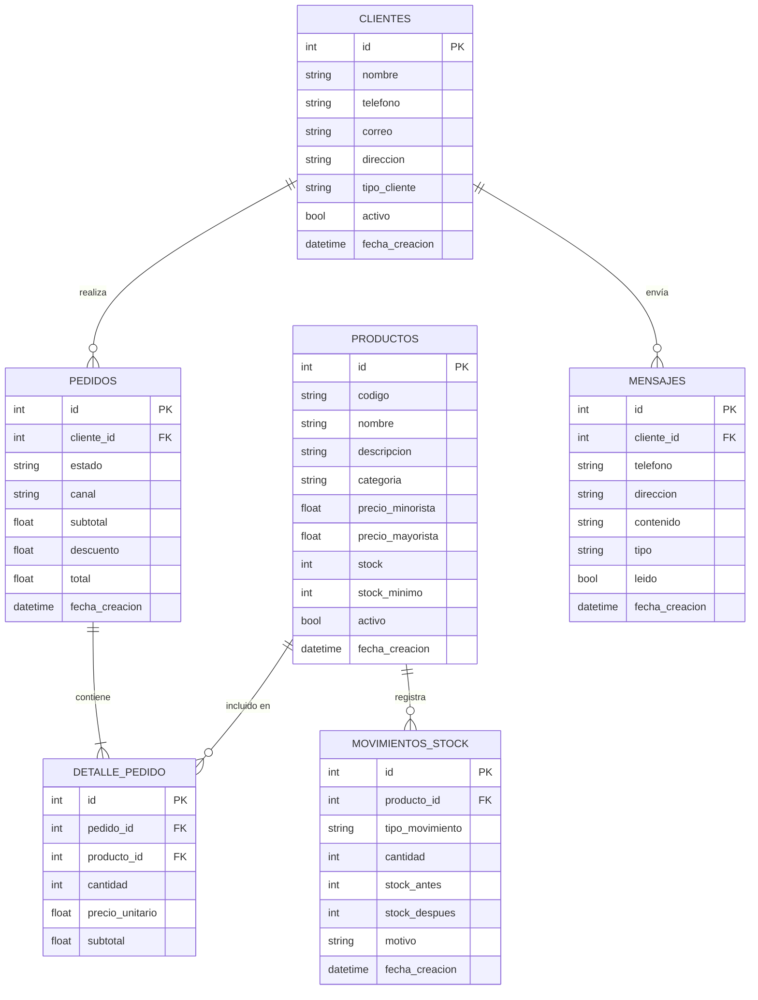

# Diagrama de Base de Datos — BodegaOS

## Diagrama Entidad-Relación (Mermaid)



## Descripción de Relaciones

| Relación | Tipo | Descripción |
|----------|------|-------------|
| CLIENTES → PEDIDOS | 1:N | Un cliente puede tener muchos pedidos |
| CLIENTES → MENSAJES | 1:N | Un cliente puede tener muchos mensajes |
| PEDIDOS → DETALLE_PEDIDO | 1:N | Un pedido contiene uno o más productos |
| PRODUCTOS → DETALLE_PEDIDO | 1:N | Un producto puede estar en muchos pedidos |
| PRODUCTOS → MOVIMIENTOS_STOCK | 1:N | Cada producto registra todos sus movimientos |

## Estados de Pedido

```
pendiente → en_proceso → confirmado → entregado
                              │
                              └── cancelado
```

## Tipos de Movimiento de Stock

| Tipo | Descripción |
|------|-------------|
| `entrada` | Reposición de inventario |
| `salida` | Descuento por pedido confirmado |
| `ajuste` | Corrección manual de stock |
| `devolucion` | Retorno de mercadería |
